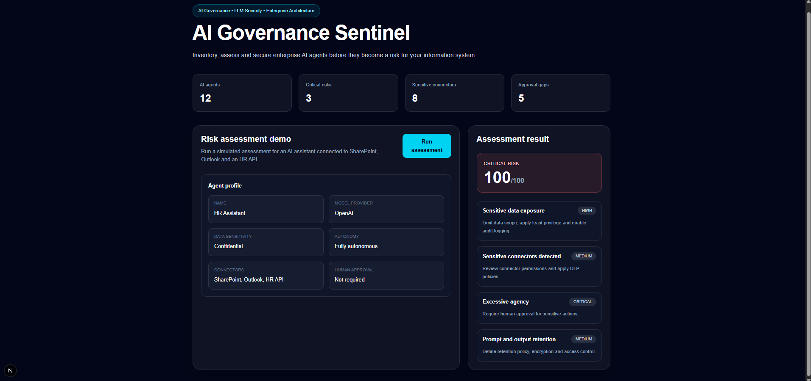

# AI Governance Sentinel

**AI Governance Sentinel** is an open-source platform designed to inventory, assess and secure enterprise AI agents, RAG systems and automation workflows.



This project is not another chatbot. It is a governance and security control plane for enterprise AI adoption.

## Problem

Organizations are deploying AI assistants and autonomous agents connected to internal tools such as SharePoint, Outlook, GitHub, databases, APIs and business applications.

The risk is no longer only the model itself. The real risk is the combination of sensitive data access, excessive permissions, autonomous actions, weak auditability, prompt injection, insecure connectors, missing human approval and poor governance.

## Vision

AI Governance Sentinel helps teams answer a simple question:

> Which AI agents are using our data, with which permissions, and what level of risk?

## Core Features

### V1 - MVP

- AI agent inventory
- Risk scoring engine
- Connector risk analysis
- Human approval recommendations
- Prompt and output retention checks
- API-first architecture
- Docker-based local environment

### Upcoming

- Web dashboard
- Prompt injection test suite
- Compliance mapping
- RAG governance assistant
- Audit reports
- OpenTelemetry traces
- Kubernetes deployment
- MCP gateway experimentation

## Architecture

```txt
apps/
├─ web/          Next.js frontend
└─ api/          FastAPI backend

docs/            Architecture, threat model, roadmap
docker-compose   Local development stack
```

## Tech Stack

- Frontend: Next.js, TypeScript, Tailwind CSS
- Backend: FastAPI, Python
- Database: PostgreSQL
- Infrastructure: Docker Compose
- Future: OpenTelemetry, Grafana, pgvector, Kubernetes

## Local Development

### Start the frontend

```bash
cd apps/web
npm install
npm run dev
```

### Start the backend

```bash
cd apps/api
python -m venv .venv
source .venv/bin/activate
pip install -r requirements.txt
uvicorn app.main:app --reload
```

On Windows PowerShell:

```powershell
cd apps\api
.\.venv\Scripts\Activate.ps1
pip install -r requirements.txt
uvicorn app.main:app --reload
```

Backend health check:

```txt
http://localhost:8000/health
```

API documentation:

```txt
http://localhost:8000/docs
```

## Example Risk Assessment Payload

```json
{
  "name": "HR Assistant",
  "purpose": "Answer HR policy questions and draft internal emails",
  "model_provider": "OpenAI",
  "data_sensitivity": "confidential",
  "autonomy_level": "fully_autonomous",
  "connectors": ["sharepoint", "outlook", "hr_api"],
  "internet_exposed": false,
  "human_approval_required": false,
  "stores_prompts": true,
  "stores_outputs": true
}
```

## Security Principles

- Least privilege by design
- Human-in-the-loop for sensitive actions
- Auditability of agent decisions
- Risk-based governance
- Connector-level security analysis
- Privacy and retention awareness

## Roadmap

- [x] Repository bootstrap
- [x] FastAPI risk scoring API
- [ ] Frontend dashboard
- [ ] Agent inventory CRUD
- [ ] PostgreSQL persistence
- [ ] Prompt injection test suite
- [ ] AI risk report export
- [ ] Authentication and RBAC
- [ ] Observability dashboard
- [ ] Kubernetes deployment

## Author

Built by Wali Diabi as a practical AI, cloud, cybersecurity and enterprise architecture project.

## Demo Scenarios

The project includes realistic enterprise AI governance scenarios:

- Low-risk public FAQ assistant
- Critical-risk HR assistant
- High-risk finance analysis agent
- Medium-risk public support agent

See [Demo Scenarios](docs/demo-scenarios.md).

## Roadmap

See [Roadmap](ROADMAP.md).
